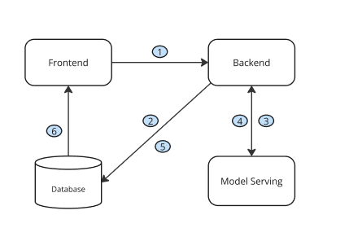

# Basic Architecture (no frontend)

1. The user put a Youtube video title or id and submits with a button
2. The backend checks if there is already an entry with data for the video that was requested
3. The backend receives the video information, get the transcripts of the video and does a summary request. At the same time it stores the transcript into the database
4. The model serving makes a summary of the video and send it back to the backend service.
5. The backend service adds the sumary of the video transcript in the database
6. The Frontend fetches all the information needed to display the summary
# Setting up the virual environment

### Step 1: Create a virtual environment
python3 -m venv yousum_env

### Step 2: Activate the virtual environment
source yousum_env/bin/activate  # For macOS and Linux

### Step 3: Install the packages from requirements.txt
brew install postgresql
pip install -r requirements.txt

### Step 4: Deactivate the virtual environment when done
deactivate

# Get Podman and setup the DB
```
brew update && brew upgrade podman
```
```
podman pull registry.redhat.io/rhel9/postgresql-15:latest
```
```
podman volume create pgdata

podman run -d \
  --name my-postgres \
  -p 5432:5432 \
  -e POSTGRESQL_USER=dbadmin \
  -e POSTGRESQL_PASSWORD=mysecretpassword \
  -e POSTGRESQL_DATABASE=youtube_data \
  -e POSTGRESQL_ADMIN_PASSWORD=adminsecret \
  -v pgdata:/var/lib/pgsql/data:Z \
  registry.redhat.io/rhel9/postgresql-15:latest
```

```
podman logs my-postgres
```

```
podman exec -it my-postgres /bin/bash
psql -U postgres -d youtube_data
# Check columns in table
\d youtube_transcripts
# See value from a given column
SELECT video_id FROM youtube_transcripts;
# Delete line base on a column value
DELETE FROM table_name WHERE column_name = 'value';
```

# Running the App

## Testing
```
# Save transcript without summary with video_id
curl -X POST -H "Content-Type: application/json" \
     -d '{"video_id": "Wf4IF1KLWs8", "title": "Trump’s Controversial Plan to Eliminate Income Taxes"}' \
     http://localhost:5000/transcript
    
# Save transcript without summary with title    
curl -X POST -H "Content-Type: application/json" \
     -d '{
       "title": "Trump’s Controversial Plan to Eliminate Income Taxes",
       "summarize": false
     }' \
     http://localhost:5000/transcript

# Save transcript with summary
curl -X POST -H "Content-Type: application/json" \
     -d '{"video_id": "Wf4IF1KLWs8", "title": "Trump’s Controversial Plan to Eliminate Income Taxes", "summarize": true}' \
     http://localhost:5000/transcript

# Retrieve transcript (by ID)
curl http://localhost:5000/transcript/1
```